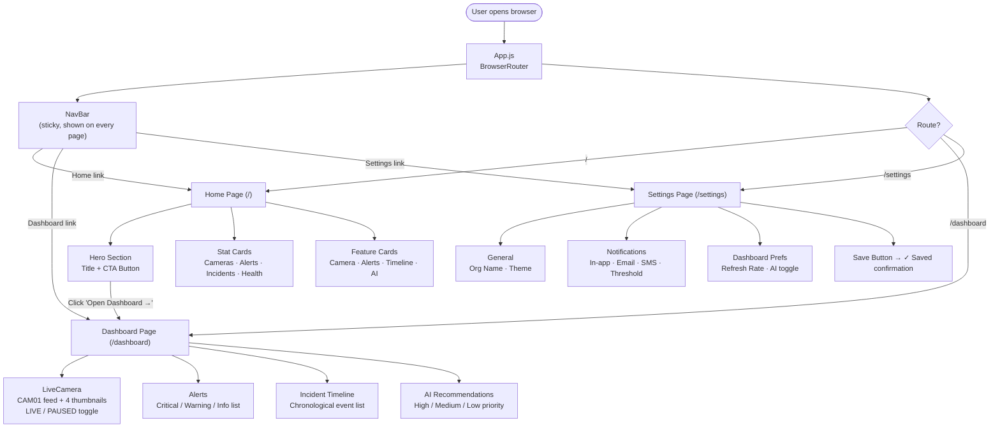
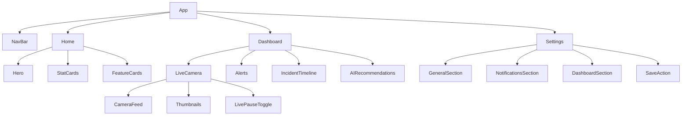
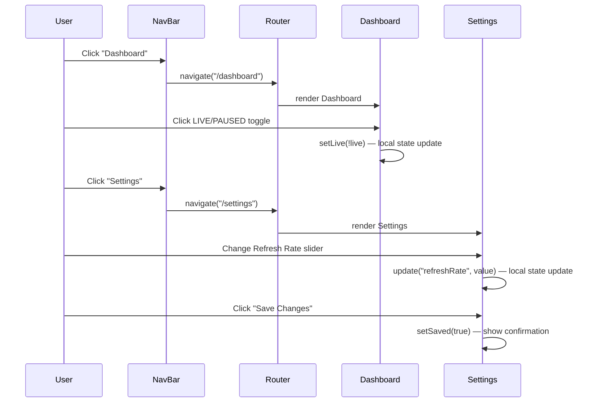

# Warehouse Monitoring System

A real-time monitoring and AI-assisted response dashboard built with **React** and **React Router**.

---

## Table of Contents

1. [Project Overview](#project-overview)
2. [Tech Stack](#tech-stack)
3. [Project Structure](#project-structure)
4. [UI Flow Diagram](#ui-flow-diagram)
5. [Page Breakdown](#page-breakdown)
   - [Home](#home-page--)
   - [Dashboard](#dashboard-page-dashboard)
   - [Settings](#settings-page-settings)
6. [Component Tree](#component-tree)
7. [State Flow](#state-flow)
8. [Getting Started](#getting-started)

---

## Project Overview

The Warehouse Monitoring System is a single-page application with three routes. A persistent navigation bar lets users move between a landing page, a live monitoring dashboard, and a settings panel.

---

## Tech Stack

| Layer      | Technology               |
|------------|--------------------------|
| UI Library | React 19                 |
| Routing    | React Router DOM v6      |
| Styling    | Plain CSS (per-component) |
| Bundler    | Create React App         |

---

## Project Structure

```
my-app/
├── public/
│   └── index.html
└── src/
    ├── App.js            # BrowserRouter + route definitions
    ├── App.css
    ├── NavBar.js         # Sticky top navigation bar
    ├── NavBar.css
    ├── Home.js           # Landing page  (route: /)
    ├── Home.css
    ├── Dashboard.js      # Monitoring page (route: /dashboard)
    ├── Dashboard.css
    ├── Settings.js       # Settings page  (route: /settings)
    ├── Settings.css
    ├── index.js          # ReactDOM entry point
    └── index.css
```

---

## UI Flow Diagram



---

## Page Breakdown

### Home Page — `/`

The entry point of the application.

| Section           | Description                                                                                    |
|-------------------|-----------------------------------------------------------------------------------------------|
| **Hero**          | App title, subtitle, and a "Open Dashboard →" CTA that navigates to `/dashboard`             |
| **Stat Cards**    | Four cards: Active Cameras, Open Alerts, Incidents Today, System Health                       |
| **Feature Cards** | Four cards summarising each dashboard capability with an icon and description                 |

---

### Dashboard Page — `/dashboard`

The main monitoring view, laid out in a **2-column responsive grid**.

| Component              | Responsibility                                                                                    |
|------------------------|--------------------------------------------------------------------------------------------------|
| **LiveCamera**         | Simulated camera feed for CAM01 with animated scanline. Toggle switches between LIVE and PAUSED. Four thumbnail slots for CAM02–CAM05. |
| **Alerts**             | Three severity-coded alerts (critical, warning, info) with a badge showing the count.            |
| **IncidentTimeline**   | Vertical chronological list of four incidents with timestamp, title, and detail.                 |
| **AIRecommendations**  | Three prioritised action items (High / Medium / Low) generated by the AI model.                 |

---

### Settings Page — `/settings`

A controlled form managing user preferences via React `useState`.

| Section            | Controls                                                                          |
|--------------------|-----------------------------------------------------------------------------------|
| **General**        | Organisation Name (text input), Theme (dropdown: Dark / Light / System)           |
| **Notifications**  | In-app alerts, Email alerts, SMS alerts (checkboxes), Alert threshold (dropdown)  |
| **Dashboard**      | Refresh rate (range slider 1–30 s), Show AI recommendations (checkbox)            |
| **Actions**        | Save Changes button — shows "✓ Settings saved" confirmation on submit             |

---

## Component Tree



---

## State Flow



---

## Getting Started

```bash
# Install dependencies
cd my-app
npm install

# Start development server
npm start
```

The app opens at **http://localhost:3000** (or the next available port).

| Route        | Page      |
|--------------|-----------|
| `/`          | Home      |
| `/dashboard` | Dashboard |
| `/settings`  | Settings  |

Runs the app in the development mode.\
Open [http://localhost:3000](http://localhost:3000) to view it in your browser.

The page will reload when you make changes.\
You may also see any lint errors in the console.

### `npm test`

Launches the test runner in the interactive watch mode.\
See the section about [running tests](https://facebook.github.io/create-react-app/docs/running-tests) for more information.

### `npm run build`

Builds the app for production to the `build` folder.\
It correctly bundles React in production mode and optimizes the build for the best performance.

The build is minified and the filenames include the hashes.\
Your app is ready to be deployed!

See the section about [deployment](https://facebook.github.io/create-react-app/docs/deployment) for more information.

### `npm run eject`

**Note: this is a one-way operation. Once you `eject`, you can't go back!**

If you aren't satisfied with the build tool and configuration choices, you can `eject` at any time. This command will remove the single build dependency from your project.

Instead, it will copy all the configuration files and the transitive dependencies (webpack, Babel, ESLint, etc) right into your project so you have full control over them. All of the commands except `eject` will still work, but they will point to the copied scripts so you can tweak them. At this point you're on your own.

You don't have to ever use `eject`. The curated feature set is suitable for small and middle deployments, and you shouldn't feel obligated to use this feature. However we understand that this tool wouldn't be useful if you couldn't customize it when you are ready for it.

## Learn More

You can learn more in the [Create React App documentation](https://facebook.github.io/create-react-app/docs/getting-started).

To learn React, check out the [React documentation](https://reactjs.org/).

### Code Splitting

This section has moved here: [https://facebook.github.io/create-react-app/docs/code-splitting](https://facebook.github.io/create-react-app/docs/code-splitting)

### Analyzing the Bundle Size

This section has moved here: [https://facebook.github.io/create-react-app/docs/analyzing-the-bundle-size](https://facebook.github.io/create-react-app/docs/analyzing-the-bundle-size)

### Making a Progressive Web App

This section has moved here: [https://facebook.github.io/create-react-app/docs/making-a-progressive-web-app](https://facebook.github.io/create-react-app/docs/making-a-progressive-web-app)

### Advanced Configuration

This section has moved here: [https://facebook.github.io/create-react-app/docs/advanced-configuration](https://facebook.github.io/create-react-app/docs/advanced-configuration)

### Deployment

This section has moved here: [https://facebook.github.io/create-react-app/docs/deployment](https://facebook.github.io/create-react-app/docs/deployment)

### `npm run build` fails to minify

This section has moved here: [https://facebook.github.io/create-react-app/docs/troubleshooting#npm-run-build-fails-to-minify](https://facebook.github.io/create-react-app/docs/troubleshooting#npm-run-build-fails-to-minify)
